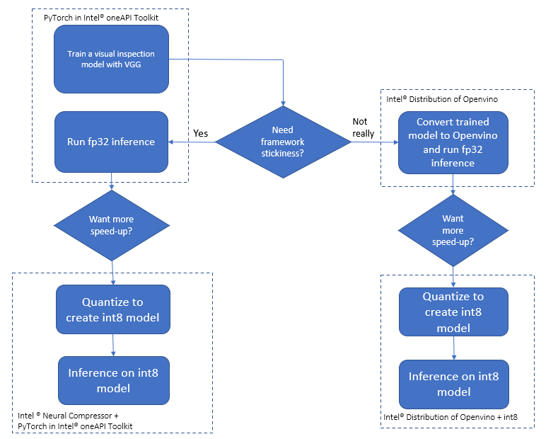
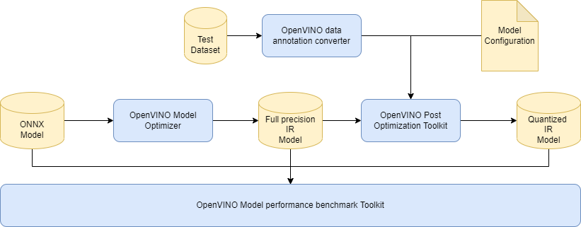
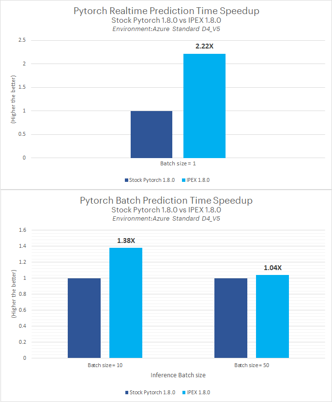
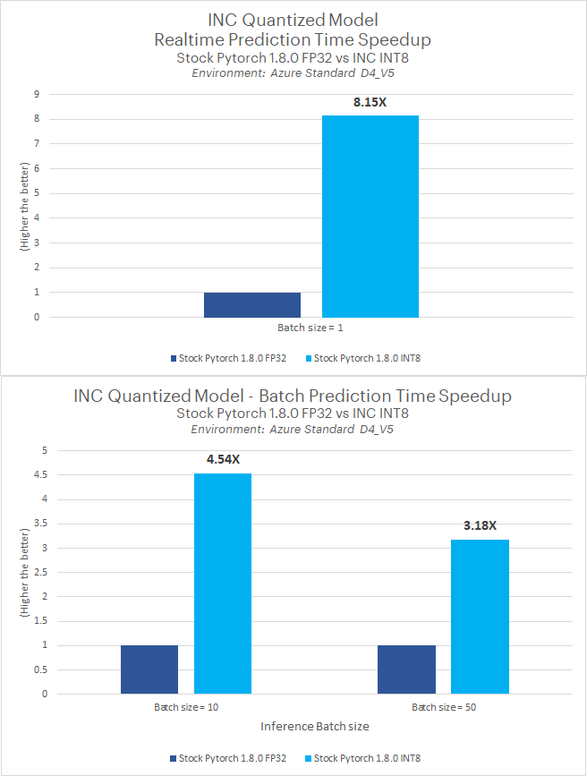
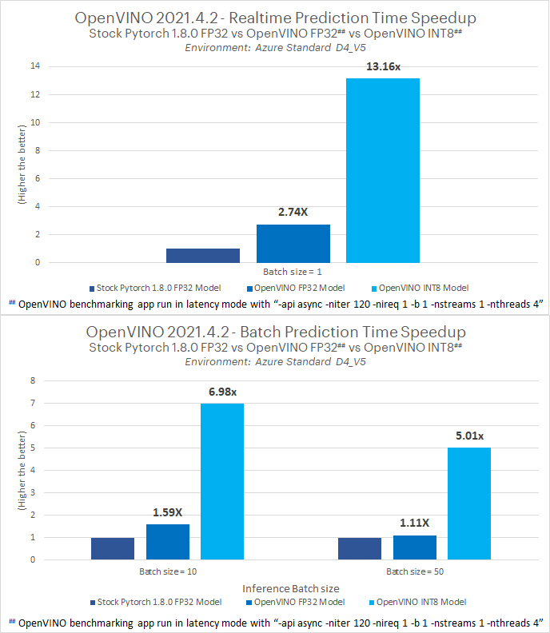

# **PyTorch Quality Visual Inspection**
PyTorch is a machine learning open source framework, and is based on the popular Torch library. PyTorch is designed to provide good flexibility and high speeds for deep neural network implementation.
PyTorch is different from other deep learning frameworks in that it uses dynamic computation graphs. While static computational graphs (like those used in TensorFlow) are defined prior to runtime, dynamic graphs are defined "on the fly" via the forward computation. In other words, the graph is rebuilt from scratch on every iteration.

Intel® Extension for PyTorch provides additional optimizations for an extra performance boost on Intel® CPU.

| Platform                          | Ubuntu 20.04
| :---                              | :---
| Hardware                          | Azure Standard_D4_V5 (Icelake)
| Software                          | Intel® Distribution for Python, Intel® Extension for PyTorch, Intel® Neural Compressor, Intel® Distribution of OpenVINO™ Toolkit.
| What you will learn               | Advantage of using components in Intel® oneAPI AI Analytics Toolkit over the stock version for the computer vision based model build, tuning and inferencing.

## Purpose
In this example we highlight the difference of using deep learning, machine learning tools/libraries in Intel® oneAPI AI Analytics Toolkit against the stock versions. We use a computer vision based model building for quality visual inspection based on a dataset for pharma industry. It includes different data augmentations and train the VGG model using this dataset.

The time required for training the model, inference time and the accuracy of the model are captured for multiple runs on the stock version as well on those in Intel® oneAPI AI Analytics Toolkit. The average of these runs are considered and the comparison have been provided.
  
## Key Implementation Details
This sample code is implemented for CPU using the Python language and Intel® Extension for PyTorch* v1.8.0 has been used in this code base. VGGNet, a classical convolutional neural network (CNN) architecture is being used for training. VGG was developed to increase the depth of such CNNs in order to increase the model performance and it is widely used in computer vision use cases. Tuning parameters has been introduced to the model in an optimization algorithm with different learning rate for checking how quickly the model is adapted to the problem in order to increase the model performance.

### **Use Case E2E flow**


### Reference Sources
*DataSet*: https://www.mvtec.com/company/research/datasets/mvtec-ad (only download Pill (262 MB) dataset for this use case)<br>
> *Please see this data set's applicable license for terms and conditions. Intel does not own the rights to this data set and does not confer any rights to it.*

*Case Study*: https://towardsdatascience.com/explainable-defect-detection-using-convolutional-neural-networks-case-study-284e57337b59<br>
*VGG16 Model Training*: https://github.com/OlgaChernytska/Visual-Inspection

## Overview
### Environment
Below are the developer environment used for this module on Azure. All the observations captured are based on these environment setup.

| **Size** | **CPU Cores** | **Memory**  | **Intel CPU Family**
| :--- | :--: | :--: | :--:
| *Standard_D4_V5* | 4 | 16GB | ICELAKE

### Packages
| **Package**                | **Stock Python**                | **Intel Python**
| :---                       | :---                            | :---
| python                     | python=3.9.7=hdb3f193_2         | python=3.9.7=h718aa4a_4
| pytorch                    | pytorch=1.8.0                   | pytorch=1.8.0=py39_0
| IPEX                       | *NA*                            | intel-extension-for-pytorch=1.8.0=py39_0
| neural-compressor          | neural-compressor==1.12         | *NA*
| openVINO                   | OpenVINO™ Toolkit- 2021.4.2     | *NA*

### Dataset
| **Use case** | Anomaly detection on product inspection
| :--- | :---
| **Object of interest** | Pill
| **Data augmentation techniques** | Flipping, Rotation, Enhancing, Center cropping
| **Size** | Total 700 Labelled Images<br> (Post data cloning)
| **Train : Test Split** | 80:20

## Training
VGG-16 is a convolutional neural network that is 16 layers deep and same has been used as classification architecture to classify the good and defect samples from the production pipeline.
Intel® Extension for PyTorch* is used for transfer learning the VGGNet classification architecture on the pill dataset created. Same experiment performed in stock PyTorch version of VGGNet.

| **Input Size** | 224x224
| :--- | :---
| **Output Model format** | pytorch

### Tuning
Created VGGNet classification architecture on the dataset and fine tune the hyper parameters to reach out the maximum accuracy. Introduced different learning rate to the model architecture on the dataset, also we increased the number of epochs to reach maximum accuracy on the training set. HyperParameters considered for tuning are Learning Rate & Epochs.

*Parameters considered* `Learning Rate, Epochs, Target training accuracy`
> Created code replication for GridSearchCV to support the code base.

### Inference
Performed inferencing using the trained model with
- Stock PyTorch
- Intel® Extension for PyTorch
- Intel® Neural Compressor
- Intel® Distribution of OpenVINO™ Toolkit

#### Intel® Extension for PyTorch
The below changes have been done to the stock PyTorch training code base to utilize the Intel® Extension for PyTorch* performance.
One can enable the intel flag to incorporate below Intel Pytorch optimizations.
```
import intel_pytorch_extension as ipex
...
model = model.to(ipex.DEVICE)
inputs = inputs.to(ipex.DEVICE)
labels = labels.to(ipex.DEVICE)
...
```

## Usage and Instructions
Below are the steps to reproduce the bechmarking results given in this repository
1. Creating the execution environment
2. Dataset preparation
3. Training VGG16 model
4. Model Inference
5. Quantize trained models using INC and benchmarking
6. Quantize trained models using OpenVINO and benchmarking
7. Observations

### 1. Environment Creation
#### Prerequistes
[Anaconda installation](https://docs.anaconda.com/anaconda/install/linux/)

**Setting up the environment for Stock PyTorch**<br>Follow the below conda installation commands to setup the Stock PyTorch environment for the model training and prediction. 
```sh
conda env create -f env/stock/stock-pytorch.yml
```
*Activate stock conda environment*
Use the following command to activate the environment that was created:
```sh
conda activate stock-pytorch
```

**Setting up the environment for Intel PyTorch**<br>Follow the below conda installation commands to setup the Intel PyTorch environment for the model training and prediction.
```sh
conda env create -f env/intel/aikit-pt.yml
```
*Activate intel conda environment*
Use the following command to activate the environment that was created:
```sh
conda activate aikit-pt
```

### 2. Data preparation

> The pill dataset is downloaded and extracted in a folder before running the training python module.

The dataset available from the source requires a filtering before the training. Assuming the pill dataset is downloaded from the dataset source given above in this document, Follow the below steps to filter the dataset extracted from the source.
```sh
tar -xf pill.tar.xz

mkdir -p data/{train/{good,bad},test/{good,bad}}

cd pill/train/good/
cp $(ls | head -n 210) ../../../data/train/good/
cp $(ls | tail -n 65) ../../../data/test/good/

cd pill/test/combined
cp $(ls | head -n 17) ../../../data/train/bad/
cp $(ls | tail -n 5) ../../../data/test/bad/
```

**Data Cloning**

> **Note** Data cloning is optional step to reproduce the simillar training and tuning benchmarking results pubilshed in this repository

Assuming that pill dataset is downloaded and created the folder structure as mentioned above. Use the below code to clone the data to handle data distribution. Data will be cloned in same directory (e.g. "data")
```
usage: clone_dataset.py [-h] [-d DATAPATH]

optional arguments:
  -h, --help            show this help message and exit
  -d DATAPATH, --datapath DATAPATH
                        dataset path which consists of train and test folders
```

Use the below sample command to perform data cloning
```sh
python clone_dataset.py -d ../data 
```

### 3. Training VGG16 model
Run the training module as given below to start training and prediction using the active environment. This module takes option to run the training with and without hyper parameter tuning.
```
usage: training.py [-h] [-d DATAPATH] [-o OUTMODEL] [-a DATAAUG] [-hy HYPERPARAMS] [-i INTEL]

optional arguments:
  -h, --help            show this help message and exit
  -d DATAPATH, --datapath DATAPATH
                        dataset path which consists of train and test folders
  -o OUTMODEL, --outmodel OUTMODEL
                        outfile name without extension to save the model
  -a DATAAUG, --dataaug DATAAUG
                        use 1 for enabling data augmentation, default is 0
  -hy HYPERPARAMS, --hyperparams HYPERPARAMS
                        use 1 for enabling hyperparameter tuning, default is 0
  -i INTEL, --intel INTEL
                        use 1 for enabling intel pytorch optimizations, default is 0
```
*Command to run stock training without data augmentation and hyperparameter tuning*
```sh
python training.py -d ../data
```
*Command to run stock training with data augmentation and without hyperparameter tuning*
```sh
python training.py -d ../data -a 1
```
*Command to run stock training with hyperparameter tuning*
```sh
python training.py -d ../data -hy 1
```
*Command to run stock training with data augmentation and hyperparameter tuning*
```sh
python training.py -d ../data -a 1 -hy 1
```
> **Note**<br>Above training commands can be run in intel environment with intel flag (e.g. "-i 1") enabled<br>The output trained model would be saved in both pytorch and onnx format. ONNX format can be used for OpenVINO IR conversion directly.

*Expected Output for training without data augmentation and hyperparameter tuning*<br>Below output would be generated by the training module which will capture the overall training time.
```
Dataset path Found!!
Train and Test Data folders Found!
Dataset data/: N Images = 694, Share of anomalies = 0.218
Epoch 1/10: Loss = 0.6575, Accuracy = 0.7236
Epoch 2/10: Loss = 0.4175, Accuracy = 0.8455
Epoch 3/10: Loss = 0.3731, Accuracy = 0.8691
Epoch 4/10: Loss = 0.2419, Accuracy = 0.9273
Epoch 5/10: Loss = 0.0951, Accuracy = 0.9745
Epoch 6/10: Loss = 0.0796, Accuracy = 0.9709
Epoch 7/10: Loss = 0.0696, Accuracy = 0.9764
Epoch 8/10: Loss = 0.0977, Accuracy = 0.9727
Epoch 9/10: Loss = 0.0957, Accuracy = 0.9727
Epoch 10/10: Loss = 0.1580, Accuracy = 0.9600
train_time= 1094.215266942978
```

**Capturing the time for training and inferencing**
The line containing `train_time` gives the time required for the training the model.
Run this script to record multiple trials and the average can be calculated.

### 4. Inference
#### Running inference using Pytorch
Use the following commands to run the inference on test images and get the inference timing for each batch of images.<br>

```
usage: pytorch_evaluation.py [-h] [-d DATA_FOLDER] [-m MODEL_PATH] [-i INTEL] [-b BATCHSIZE]

optional arguments:
  -h, --help            show this help message and exit
  -d DATA_FOLDER, --data_folder DATA_FOLDER
                        dataset path which consists of train and test folders
  -m MODEL_PATH, --model_path MODEL_PATH
                        Absolute path to the h5 pytorch model with extension ".h5"
  -i INTEL, --intel INTEL
                        use 1 for enabling intel pytorch optimizations, default is 0
  -b BATCHSIZE, --batchsize BATCHSIZE
                        use the batchsize that want do inference, default is 1
```

*Command to run real-time inference using stock PyTorch*
```sh
python pytorch_evaluation.py -d ../data -m ./{trained_model.h5} -b 1
```

*Command to run the real-time inference using Intel Pytorch*
```sh
python pytorch_evaluation.py -d ../data -m ./{trained_model.h5} -b 1 -i 1
```

> By using different batchsize one can observe the gain obtained using Intel® Extension for PyTorch

### 5. Quantize trained models using Intel® Neural Compressor
Intel® Neural Compressor is used to quantize the FP32 Model to the INT8 Model. Optimzied model is used here for evaluating and timing Analysis.
Intel® Neural Compressor supports many optimization methods. In this case, we used post training quantization with `Accuracy aware mode` method to quantize the FP32 model.

*Step-1: Conversion of FP32 Model to INT8 Model*

```
usage: neural_compressor_conversion.py [-h] [-d DATAPATH] [-m MODELPATH]
                                       [-c CONFIG] [-o OUTPATH] [-i INTEL]

optional arguments:
  -h, --help            show this help message and exit
  -d DATAPATH, --datapath DATAPATH
                        dataset path which consists of train and test folders
  -m MODELPATH, --modelpath MODELPATH
                        Model path trained with pytorch ".h5" file
  -c CONFIG, --config CONFIG
                        Yaml file for quantizing model, default is
                        "./config.yaml"
  -o OUTPATH, --outpath OUTPATH
                        default output quantized model will be save in
                        ./output folder
```

*Command to run the neural_compressor_conversion*
> Activate stock Environment before running
```
cd intel_neural_compressor
python neural_compressor_conversion.py -d ../data/ -m ../{trained_model.h5} 
```
> Quantized model will be saved by default in `output` folder


*Step-2: Inferencing using quantized Model*
```
usage: neural_compressor_inference.py [-h] [-d DATAPATH] [-fp32 FP32MODELPATH]
                                      [-c CONFIG] [-int8 INT8MODELPATH]
                                      [-i INTEL]

optional arguments:
  -h, --help            show this help message and exit
  -d DATAPATH, --datapath DATAPATH
                        dataset path which consists of train and test folders
  -fp32 FP32MODELPATH, --fp32modelpath FP32MODELPATH
                        Model path trained with pytorch ".h5" file
  -c CONFIG, --config CONFIG
                        Yaml file for quantizing model, default is
                        "./config.yaml"
  -int8 INT8MODELPATH, --int8modelpath INT8MODELPATH
                        load the quantized model folder. default is ./output
                        folder
```

*Command to run neural_compressor_inference for realtime `(batchsize =1)`*
```
python neural_compressor_inference.py -d ../data/ -fp32 ../{trained_model.h5}  -int8 ./output -b 1
```
> Use `-b` to test with different batch size (e.g. `-b 10`)

### 6. Quantize trained models using Intel® Distribution of OpenVINO
When it comes to the deployment of this model on Edge devices, with less computing and memory resources, we further need to explore options for quantizing and compressing the model which brings out the same level of accuracy and efficient utilization of underlying computing resources. Intel® Distribution of OpenVINO™ Toolkit facilitates the optimization of a deep learning model from a framework and deployment using an inference engine on such computing platforms based on Intel hardware accelerators. Below section covers the steps to use this toolkit for the model quantization and measure its performance.

#### Setting up the environment for Intel® Distribution of OpenVINO
*Toolkit Installation*
Intel® Distribution of OpenVINO™ Toolkit used here is **2021.4.2** on Ubuntu 20.04 by following the installation procedure at
https://docs.openvino.ai/latest/openvino_docs_install_guides_installing_openvino_linux.html#install-openvino

*POT (Post Optimization Toolkit) Installation*
https://docs.openvino.ai/2021.4/pot_InstallationGuide.html#doxid-pot-installation-guide

**OpenVINO Intermediate Representation (IR) conversion** <br>
Below are the steps to onvert ONNX model representation to OpenVINO IR using OpenVINO model converter.

*Pre-requisites*
The OpenVINO running environment has been installed as the standard installation procedure.

ONNX model should be generated using `training.py` without enabling hyperparameter tuning.

By default as per the openvino documentation installation location is as follows
  1. For root or administrator: `/opt/intel/openvino_<version>/`
  2. For regular users: `/home/<USER>/intel/openvino_<version>/`

```sh
source /opt/intel/openvino_2021/bin/setupvars.sh
python /opt/intel/openvino_2021/deployment_tools/model_optimizer/mo_onnx.py --input_model <trained pill onnx model> --output_dir <output directory>
```

> The above step will generate `<model-name>.bin` and `<model-name.xml` as output which can be used with OpenVINO inference application. Default precision is FP32.

**Running inference using OpenVINO**<br>Command to perform inference using OpenVINO. The model need to be converted to IR format as per the section OpenVINO IR conversion. 

> *Note*<br>This module is based on the hello_classification python module from the OpenVINO package.

```
usage: openvino_inference.py [-h] -m MODEL -i INPUT [-l EXTENSION] [-c CONFIG] [-d DEVICE] [--labels LABELS] [-nt NUMBER_TOP] [--outputname OUTPUTNAME]

Options:
  -h, --help            Show this help message and exit.
  -m MODEL, --model MODEL
                        Required. Path to an .xml or .onnx file with a trained model.
  -i INPUT, --input INPUT
                        Required. Path to an image file(s).
  -l EXTENSION, --extension EXTENSION
                        Optional. Required by the CPU Plugin for executing the custom operation on a CPU. Absolute path to a shared library with the kernels implementations.
  -c CONFIG, --config CONFIG
                        Optional. Required by GPU or VPU Plugins for the custom operation kernel. Absolute path to operation description file (.xml).
  -d DEVICE, --device DEVICE
                        Optional. Specify the target device to infer on; CPU, GPU, MYRIAD, HDDL or HETERO: is acceptable. The sample will look for a suitable plugin for device specified. Default value is CPU.
  --labels LABELS       Optional. Path to a labels mapping file.
  -nt NUMBER_TOP, --number_top NUMBER_TOP
                        Optional. Number of top results.
  --outputname OUTPUTNAME
                        Optional. Output blob name for the classification.
```
*Sample output*
```
[ INFO ] Image path: /pill_detection/pill/test/good/018.png Inference time 0.0390775203704834 secs
[ INFO ] Image path: /pill_detection/pill/test/good/016.png Inference time 0.01861429214477539 secs
[ INFO ] Image path: /pill_detection/pill/test/good/017.png Inference time 0.017536640167236328 secs
[ INFO ] Image path: /pill_detection/pill/test/good/003.png Inference time 0.01746678352355957 secs
[ INFO ] Image path: /pill_detection/pill/test/good/004.png Inference time 0.017514705657958984 secs
[ INFO ] Image path: /pill_detection/pill/test/good/025.png Inference time 0.01749396324157715 secs
[ INFO ] Image path: /pill_detection/pill/test/good/014.png Inference time 0.017452716827392578 secs
```

#### Benchmarking with OpenVINO Post-Training Optimization Tool
Post-training Optimization Tool (POT) is designed to accelerate the inference of deep learning models by applying special methods without model retraining or fine-tuning, like post-training quantization.

*Pre-requisites*
- Intel® Distribution of OpenVINO™ Toolkit
- OpenVINO IR converted FP32/16 precision model
- Dataset for validation

*High level flow for the quantization model conversion and benchmarking*


*Environment Setup*
- Python 3.6 or higher
- Intel® Distribution of OpenVINO™ Toolkit v2021.4.2
- Post-Training Optimization Tool

**Performance Benchmarking of full precision (FP32) Model**<br>Use the below command to run the benchmark tool for the ONNX model generated using this codebase for the pill anamoly detection. 

> Assuming the Intel OpenVINO toolkit is installed and the POT Installation has been completed as per the OpenVINO guide.
> NOTE: Running setupvars.sh is required only once

```sh
source /opt/intel/openvino_2021/bin/setupvars.sh
python3 /opt/intel/openvino_2021/deployment_tools/tools/benchmark_tool/benchmark_app.py -m pill_intel_model.onnx
```

Use the below command to run the benchmark tool for the OpenVINO IR model generated using this codebase for the pill anamoly detection. 
```sh
source /opt/intel/openvino_2021/bin/setupvars.sh
python3 /opt/intel/openvino_2021/deployment_tools/tools/benchmark_tool/benchmark_app.py -m pill_intel_model.xml -api async -niter 120 -nireq 1 -b 1<batch_size> -nstreams 1 -nthreads <number_of_cpu_cores>
```

#### Model Quantization
**Configurations**<br>Below are the configurations which needs to be modified prior to run this postraining optimization tool.

- `env/openvino_pot/pill_intel_model_int8.json` DefaultQuantization Configuration - Update `model`, `weights` and `config` according to the appropriate file location
- `env/openvino_pot/pill_intel_model_int8_acc.json` AccuracyAwareQuantization Configuration - Update `model`, `weights` and `config` according to the appropriate file location
- `env/openvino_pot/pill_intel_model.yml` Dataconverter Configuration - Update 'data_source' and 'data_dir' to the dataset folder location

> **Note**<br>The data converter used in this codebase is 'cls_dataset_folder' hence the test dataset to be used for the quantization conversion needs to follow the below directory structure.

```
  data
    |
    |-- test
      |-- bad
      |   |--- <Image files labelled as BAD>
      |-- good
      |   |--- <Image files labelled as GOOD>
```

*DefaultQuantization* : `env/openvino_pot/pill_intel_model_int8.json`
*AccuracyAwareQuantization* : `env/openvino_pot/pill_intel_model_int8_acc.json`

> **Note**<br>These json files contains paths of FPIR model

Use the below command to quantize the model as per the requirement. 
```sh
source /opt/intel/openvino_2021/bin/setupvars.sh
pot -c env/openvino_pot/pill_intel_model_int8.json -e
```

> When this tool execution completes successfully, it generates a folder structure with the name `results` where the quantized model files will be placed.

##### Performance Benchmarking of Quantized (INT8) Model
Use the below command to run the benchmark tool for the Quantized OpenVINO IR model generated using the steps given in the previous section.

```sh
source /opt/intel/openvino_2021/bin/setupvars.sh
python3 /opt/intel/openvino_2021/deployment_tools/tools/benchmark_tool/benchmark_app.py -m results/<path_to_the_quantized_model/pill_intel_model.xml -api async -niter 120 -nireq 1 -b 1<batch_size> -nstreams 1 -nthreads <number_of_cpu_cores>
```

### 7. Observations
This section covers the prediction time comparison between Stock PyTorch 1.8.0 and Intel PyTorch Extension (IPEX) 1.8.0 for this model.


<br>**Key Takeaways**
- Realtime prediction time speedup with IPEX 1.8.0 shows up to 2.22x against stock Pytorch 1.8.0 for the Pill anomaly detection model
- Batch prediction time speedup with IPEX 1.8.0 shows from 1.04x to 1.38x against stock Pytorch 1.8.0 for the Pill anomaly detection model

#### Intel Neural Compressor
Below are the observations on the inference timing on the quantized model created using Intel® Neural Compressor(INC) on Azure Standard_D4_V5 instance.


<br>**Key Takeaways**
- Realtime prediction time speedup with Stock Pytorch 1.8.0 INC INT8 quantized Pill anomaly detection model shows up to 8.15x against Stock Pytorch 1.8.0 FP32 model
- Batch prediction time speedup with Stock Pytorch 1.8.0 INC INT8 quantized Pill anomaly detection model shows from 3.18x  to 4.54x against Stock Pytorch 1.8.0 FP32 model

> Gain obtained here is purely with Intel® Neural Compressor(INC) quantized model without any IPEX optimizations.<br>There is only 0.001% Accuracy drop observed post quantization of FP32 model in both phases.

#### OpenVINO Post-Training Optimization Tool
This section covers the benchmarking observations using the pre and post quantized model using OpenVINO Post-Training Optimization Tool .

> **Note** Prediction time for the OpenVINO models have been taken using OpenVINO benchmarking application in Latency mode with the parameters `-api async -niter 120 -nireq 1 -b 1<batch_size> -nstreams 1 -nthreads <number_of_cpu_cores>`


<br>**Key Takeaways**
- Realtime prediction time speedup with OpenVINO FP32 Pill anomaly detection model shows up to 2.74x against Stock Pytorch 1.8.0 FP32 model
- Realtime prediction time speedup with OpenVINO INT8 quantized Pill anomaly detection model shows up to 13.16x against Stock Pytorch 1.8.0 FP32 model
- Batch prediction time speedup with OpenVINO FP32 Pill anomaly detection model shows from 1.11x  to 1.59x against Stock Pytorch 1.8.0 FP32 model
- Batch prediction time speedup with OpenVINO INT8 quantized Pill anomaly detection model shows from 5x  to 6.9x against Stock Pytorch 1.8.0 FP32 model

> There is only 0.001% Accuracy drop observed post quantization of FP32 model in both realtime and batch prediction.

#### Conclusion
With the arrival of computer vision (CV) techniques, powered by AI and deep learning, visual inspection has been digitalized and automated. Factories have installed cameras in each production line and huge quantities of images are read and processed using a deep learning model trained for defect detection. If each production line will have its CV application running on the edge to train that can show the scale of the challenge this industry faces with automation. CV applications demand, however, huge amounts of processing power to process the increasing image load, requiring a trade-off between accuracy, inference performance, and compute cost. Manufacturers will look for easy and cost-effective ways to deploy computer vision applications across edge-cloud infrastructures to balance the cost without impacting accuracy and inference performance. This reference kit implementation provides performance-optimized guide around quality visual inspection use cases that can be easily scaled across similar use cases.

## Notes:
***Please see this data set's applicable license for terms and conditions. Intel® does not own the rights to this data set and does not confer any rights to it.***